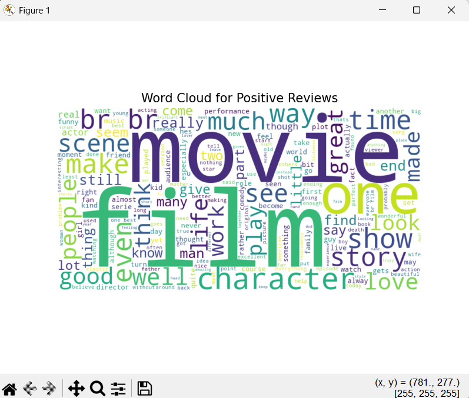
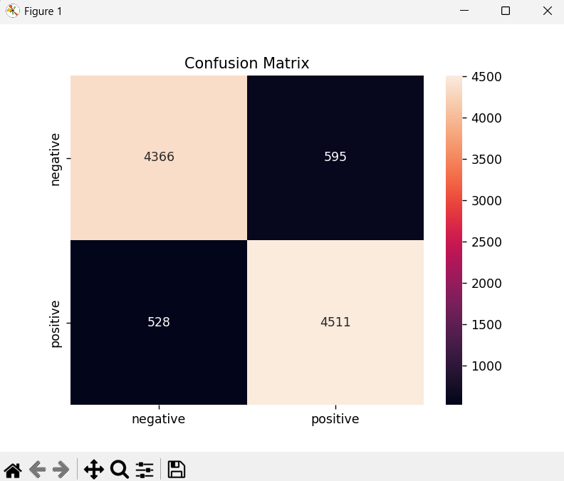

# Sentiment Analysis of Customer Comments & Reviews

## Overview
This project analyzes text reviews and classifies them into **positive** or **negative** sentiment using Python and machine learning.  
It does **not** handle neutral sentiment—reviews are classified strictly as positive or negative.

---

## Features
- Data preprocessing: cleaning text, removing stopwords  
- Sentiment classification using **Logistic Regression**  
- Model evaluation with **accuracy, precision, recall, and F1-score**  
- Visualizations: **Word Clouds** for positive/negative reviews and **Confusion Matrix**  

---

## Dataset
- [IMDB Movie Reviews Dataset](https://www.kaggle.com/datasets/lakshmi25npathi/imdb-dataset-of-50k-movie-reviews)  
- Contains 50,000 movie reviews labeled as **positive** or **negative**  

---

## How to Run
1. Clone the repository:  
   ```bash
   git clone https://github.com/yourusername/sentiment-analysis-project.git

2. Navigate into the project folder: 
   ```bash
   cd sentiment-analysis-project


3. Create and activate a Python virtual environment:
   ```bash
   python -m venv venv
   venv\Scripts\activate   # Windows
   source venv/bin/activate  # Mac/Linux


4. Navigate into the project folder: 
   ```bash
   pip install -r requirements.txt


5. Navigate into the project folder: 
   ```bash
   python sentiment_analysis.py

Model Evaluation

After running the model on the test set, the results are:

Accuracy: ~88.8%

Precision: 0.88–0.89

Recall: 0.88–0.90

F1-score: 0.89

Explanation:

The model correctly predicts the sentiment of ~89% of reviews.

Precision: when the model predicts a review as positive, it is correct ~88% of the time (similarly for negative reviews).

Recall: the model detects ~90% of actual positive reviews and ~88% of negative reviews.

F1-score: balances precision and recall, showing strong overall performance.

Visualizations

Word Clouds: shows most common words in positive and negative reviews.

Confusion Matrix: shows how many positive/negative reviews were correctly or incorrectly predicted.

| Review Text                               | Predicted Sentiment |
| ----------------------------------------- | ------------------- |
| "I absolutely loved this movie!"          | Positive            |
| "The film was boring and too long."       | Negative            |
| "Amazing acting and a great story."       | Positive            |
| "I did not enjoy the plot or characters." | Negative            |

Screenshots

Include screenshots of:

Word Clouds for positive and negative reviews

Confusion Matrix showing true vs predicted labels



